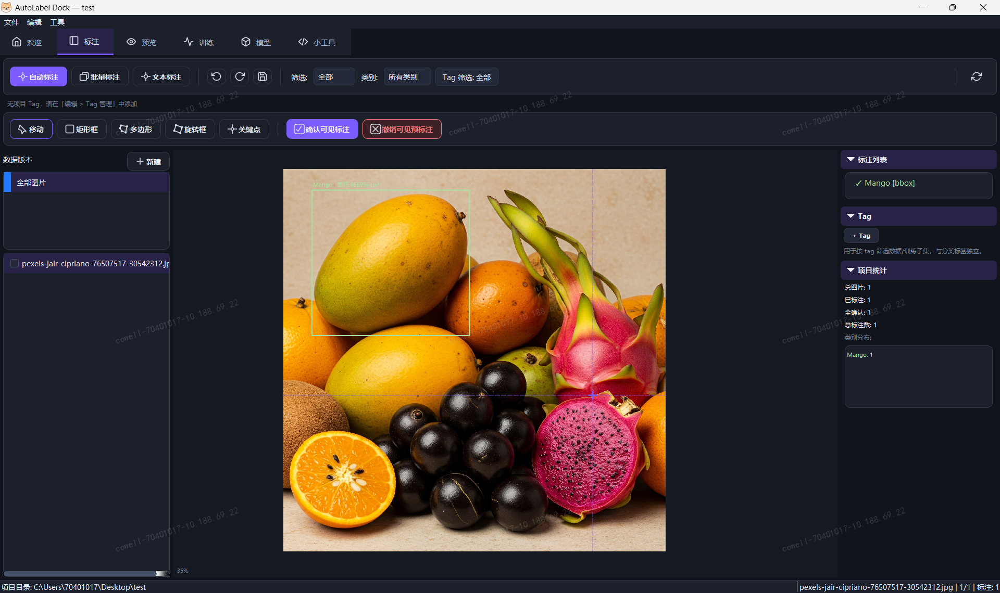
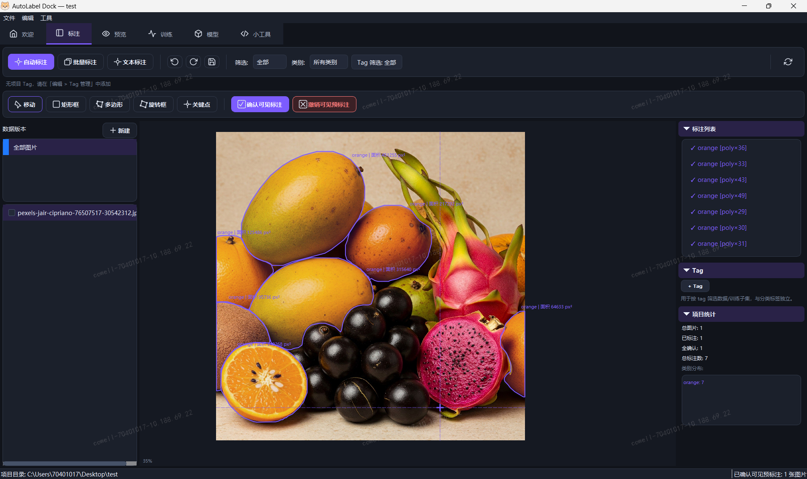
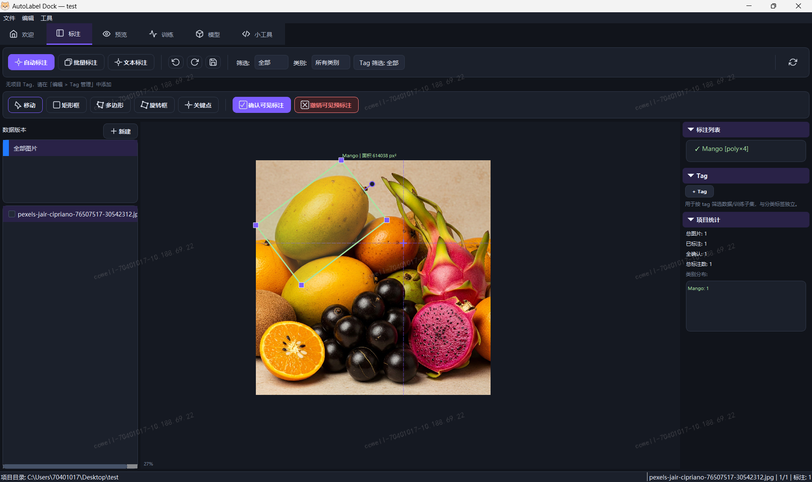
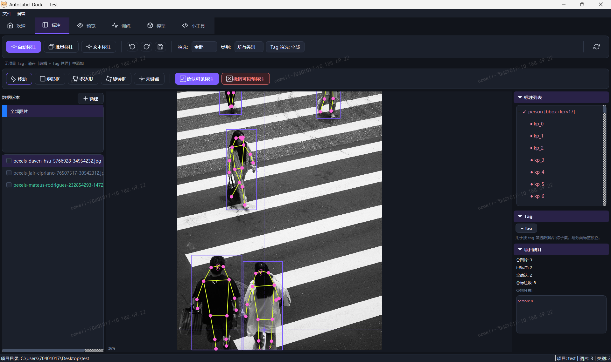

# AutoLabel Dock

> 标一点、训一版、再自动标：面向 YOLO 训练闭环的桌面端图像标注工具。


**简体中文** | [English](README_EN.md)

AutoLabel Dock 是基于 **PyQt5 + Ultralytics YOLO** 的跨平台桌面工具，覆盖人工标注、模型预标注、数据集准备、训练和迭代标注。


---

## 界面预览

| 面板   |                    截图                     |
|:-----|:-----------------------------------------:|
| 检测   |     |
| 分割   |     |
| 旋转框  |     |
| 姿态   |    |
| 分类   |     |
| 训练   |   |
| 模型管理 |  |

---

## 主要功能

### 标注任务

- **目标检测 detect**：矩形框标注。
- **实例分割 segment**：多边形标注，也可在训练导出时从矩形框退化生成矩形多边形。
- **旋转框检测 obb**：拖动创建矩形后旋转到目标方向，支持四角联动缩放。
- **关键点姿态 pose**：矩形框 + 关键点骨架标注；COCO 17 点按人体拓扑连线，并区分可见、遮挡和不可见状态，支持关键点模板。
- **图像分类 classify**：整图单标签标注，支持缩略图网格和数字键快速打标。

### 标注体验

- 类 LabelImg 的键盘流操作。
- 画布支持绘制、选择、移动、缩放、平移，以及框、关键点和多边形编辑。
- 标注显示类别与面积信息；OBB 和分割按真实多边形面积计算。
- 支持单图撤销 / 重做、切图自动保存和图片缓存。
- 图片列表按状态区分：未标注、待确认、已确认。
- 支持拖拽导入、批量确认、删除、移动和类别修改。
- 标注列表支持二次确认后清空当前图片全部标注，并可通过撤销恢复。
- 支持按状态、类别和自定义标签组合过滤。
- Catppuccin Mocha 深色主题。

### 数据预览与高级筛选

- 可按状态、类别、数据版本、Tag、尺寸、面积、置信度和中心位置组合筛选。
- 百分比条件可跨分辨率复用；分类项目仅保留图片 Tag 条件。
- 支持矩形、圆形和多边形 ROI，以及按类别配置的 OK / NG 卡控；ROI 仅用于预览分析，不写入标注或训练数据。
- 可导出包含标注、面积、卡控结果和 ROI 的当前或全部预览图。

### 数据版本

- 新建项目时，所选项目目录同时作为图片根目录；根目录下的一级子目录会自动识别为数据版本，版本内部的嵌套目录不会被重复登记。
- 可创建、重命名、移除数据版本，并在版本间移动图片及对应标签。
- 移除版本只解除索引，不删除磁盘文件；重新创建同名版本可恢复。
- 训练和批量标注可按版本、状态、类别与 Tag 选择范围。

### 模型辅助标注

- 加载 YOLO 权重后，可对单张图片或批量图片进行预标注。
- 可选每张图片只保留置信度最高的一个预测 ROI，并同步用于模型推理、自动标注和批量标注。
- 批量推理在后台线程运行，逐图落盘，可取消。
- 新预测会和已有同类已确认标注按 IoU 匹配，避免重复框。
- 自动标注默认为待确认；分类任务会保护已确认结果。
- 可选接入 LocateAnything-3B，用自然语言描述目标并生成检测框。

### 标签系统

- 图片级自定义标签独立于分类类别，支持批量设置、包含 / 排除、AND / OR 组合，并可复用于训练筛选。

### 训练闭环

- 一键准备五类 YOLO 任务的数据集，支持分层抽样、训练模板和完整超参数。
- Freeze 等训练参数在面板中直接配置，不再内置模型结构查看器。
- 数据增强预览覆盖几何、颜色、Mosaic、MixUp、Copy-Paste 等策略。
- 训练在独立子进程运行，可取消并实时显示指标；多个模型可加入队列串行训练。
- 可单独清空等待任务；停止当前训练时会同时移除全部等待任务。
- 单任务训练完成后自动保存、注册并加载最佳模型；多任务队列只注册模型，避免反复自动加载。

### 模型管理

- 支持训练模型和外部 `.pt` / `.onnx` 权重的导入、加载、重命名、删除与指标对比。
- 支持导出 PT，以及将 PT 模型转换并导出为 ONNX。
- 可对单图或目录推理，目录结果保存到 `model_predictions/`。
- YOLO 与 LocateAnything 会协调 GPU 占用。

### 小工具

- 内置可编辑的 Python 脚本运行器，支持保存自定义工具、查看实时输出和停止执行。
- 自带按标注框裁剪图片脚本，可按数据版本处理项目图片。

### 导入 / 导出

| 格式 | 导出 | 导入 | 适用任务 |
|:---|:---:|:---:|:---|
| YOLO txt | 支持 | 支持 | 检测 / 分割 / 旋转框 / 姿态 |
| roLabelImg OBB xml | 支持 | 支持 | 旋转框 |
| COCO json | 支持 | 支持 | 检测 / 分割 / 姿态 |
| labelme json | 支持 | 支持 | 检测 / 分割 / 姿态 |
| X-AnyLabeling Detect json | 支持 | 支持 | 检测 |
| X-AnyLabeling OBB json | 支持 | 支持 | 旋转框 |
| iSAT json | 支持 | 支持 | 检测 / 分割 |
| ImageFolder | 支持 | 支持 | 分类 |
| CSV | 支持 | 不支持 | 分类 |

导出会采用各格式的常见目录结构并保留图片子目录。OBB 项目兼容 YOLO 四点格式、roLabelImg XML 和 X-AnyLabeling JSON，也可自动发现未转换的侧边标注。

### 数据安全

- 新项目采用 Sidecar 存储，每张图片的标注以同名 JSON 保存在图片旁边，例如 `0001.jpg` 对应 `0001.json`；旧项目配置的独立 `labels/` 目录仍然兼容。
- 移动、重命名或删除项目图片时会同步处理对应 Sidecar JSON。
- 高风险操作前自动备份 `project.json` 和各数据版本中的标注到 `.backups/`，默认保留最近 20 份。
- 全局配置位于 `config/`，运行日志位于 `logs/`。

典型项目数据目录如下：

```text
my-project/
├── project.json
├── version-a/              数据版本
│   ├── 0001.jpg
│   └── 0001.json           与图片同目录的标注
├── version-b/              数据版本
├── datasets/               训练时生成的临时数据集
├── models/                 已注册模型
└── .backups/               自动备份
```

---

## 快速开始

```text
1. 新建项目 -> 2. 导入图片 -> 3. 标注 / 预标注 -> 4. 确认 -> 5. 训练 -> 6. 继续迭代
```

1. 新建项目：选择任务类型 `detect`、`segment`、`obb`、`pose` 或 `classify`，填写项目目录和初始类别；项目目录会直接作为图片根目录，已有一级子目录会自动成为数据版本。
2. 导入图片：将图片拖入文件列表，或选择图片目录导入；目录导入会复制图片和同名 JSON、保留子目录结构，并自动刷新数据版本。
3. 标注：手动画框、画多边形、拖动创建并旋转 OBB、放置关键点或选择分类标签；也可以加载 YOLO 权重进行自动预标注。
4. 确认：检查自动标注结果，修正后确认。
5. 训练：在训练面板选择基础模型、模板和超参数，准备数据集并启动训练。
6. 迭代：使用新训练模型继续标注未完成图片。

---

## 精细轮廓实例分割参数

下面的配置适合固定相机、单个环状目标、需要提取内外轮廓并进行面积、周长、胶宽等计算的 `segment` 项目。建议使用两阶段微调；第二阶段应选择第一阶段输出的 `best.pt` 作为基础模型。

当前示例数据只有一个 `item` 类别时，可启用 `single_cls`。训练前应保证：

- 只使用已经人工检查并确认的多边形标注。
- 训练集与验证集不包含同一实物或相邻重复帧。
- 不让 `train` 和 `val` 指向同一个图片目录。
- 修正自相交轮廓，并检查胶环内孔是否正确保留。
- 精细测量数据尽量使用高分辨率原图；提高 `imgsz` 不能恢复原图中不存在的细节。

### 第一阶段：冻结骨干网络

在训练面板中填写以下参数：

```yaml
task: segment
model: yolo26m-seg.pt
epochs: 40
batch: 4
imgsz: 1024
device: "0"
freeze: 10
workers: 4
patience: 15
val_ratio: 0.25

optimizer: AdamW
lr0: 0.001
lrf: 0.01
momentum: 0.937
weight_decay: 0.0005
warmup_epochs: 3.0
warmup_momentum: 0.8
warmup_bias_lr: 0.1

hsv_h: 0.0
hsv_s: 0.1
hsv_v: 0.2
degrees: 2.0
translate: 0.03
scale: 0.10
shear: 0.0
perspective: 0.0
flipud: 0.5
fliplr: 0.5
mosaic: 0.0
mixup: 0.0

mask_ratio: 2
overlap_mask: true
copy_paste: 0.0
copy_paste_mode: flip

single_cls: true
resume: false
```

### 第二阶段：全模型低学习率微调

选择第一阶段生成的 `best.pt`，取消 Freeze 的固定值并勾选“使用默认值”，其余参数按下面设置：

```yaml
task: segment
model: path/to/stage1/weights/best.pt
epochs: 120
batch: 4
imgsz: 1024
device: "0"
freeze: null
workers: 4
patience: 25
val_ratio: 0.25

optimizer: AdamW
lr0: 0.0003
lrf: 0.01
momentum: 0.937
weight_decay: 0.0005
warmup_epochs: 2.0
warmup_momentum: 0.8
warmup_bias_lr: 0.1

hsv_h: 0.0
hsv_s: 0.1
hsv_v: 0.2
degrees: 2.0
translate: 0.03
scale: 0.10
shear: 0.0
perspective: 0.0
flipud: 0.5
fliplr: 0.5
mosaic: 0.0
mixup: 0.0

mask_ratio: 2
overlap_mask: true
copy_paste: 0.0
copy_paste_mode: flip

single_cls: true
resume: false
```

参数说明：

| 参数 | 建议与原因 |
|:---|:---|
| `model` | 首选 `yolo26m-seg.pt`；显存不足时改用 `yolo26s-seg.pt`，不建议在极小数据集上直接使用 x 模型。 |
| `batch` | 以不发生显存溢出为准；`1024` 输入下依次尝试 4、2、1，不要通过降低 `imgsz` 优先解决。 |
| `mask_ratio` | `2` 比默认值 `4` 保留更细的训练掩膜；显存充足时可单独对比 `1`，不要与其他参数同时改变。 |
| `mosaic` | 关闭。该任务中目标占据大部分画面，Mosaic 会缩小目标并引入不真实的拼接边缘。 |
| `mixup` | 关闭。图像混合会制造不存在的半透明边界。 |
| `copy_paste` | 关闭。固定位置的单个胶环不适合粘贴出额外实例。 |
| `degrees` / `translate` / `scale` | 只使用轻量几何增强，避免插值和裁切破坏细边缘。 |
| `flipud` / `fliplr` | 仅当工件方向、光照方向和缺陷位置没有方向含义时使用 `0.5`；否则均设为 `0.0`。 |
| `overlap_mask` | 单实例图片保持 `true` 即可；它不会解决多边形自相交问题。 |
| `single_cls` | 项目始终只有一个目标类别时启用；未来增加类别时必须关闭。 |

分类任务专用的 `erasing`、`auto_augment`、`dropout`，以及姿态任务专用的 `pose`、`kobj`、`kpt_shape`，在 `segment` 训练中不会传给 Ultralytics，保持默认值即可。

### 推理与轮廓计算

- 训练和推理使用相同的 `imgsz=1024`。
- 推理保持 `retina_masks=True`，优先使用 `result.masks.data` 中的二值掩膜。
- 精密计算轮廓时使用 `cv2.RETR_CCOMP` 保留内孔，使用 `cv2.CHAIN_APPROX_NONE` 保留全部边缘点。
- 不要直接用经过较强 `approxPolyDP` 简化的多边形计算周长或胶宽。
- 除常规 mask mAP 外，建议统计 Boundary IoU、HD95、面积误差、周长误差和胶宽误差。
- 物理尺寸计算还需要相机标定，将像素坐标转换为实际长度单位。

相关参数可参考 [Ultralytics 训练配置](https://docs.ultralytics.com/modes/train)、[实例分割说明](https://docs.ultralytics.com/tasks/segment) 和 [数据增强说明](https://docs.ultralytics.com/guides/yolo-data-augmentation)。

---

## 快捷键

在“文件 → 选择图片目录…”中可将一个本地图片目录添加到当前项目，快捷键为 `Ctrl+Shift+O`。图片会复制到项目根目录并保留原有子目录结构，其中一级子目录会自动识别为数据版本；添加后标注、预览、数据版本和训练筛选会立即刷新。

### 通用

| 快捷键 | 功能 |
|:---|:---|
| `Ctrl+N` / `Ctrl+O` | 新建 / 打开项目 |
| `Ctrl+Shift+O` | 添加图片目录到当前项目 |
| `Ctrl+E` / `Ctrl+I` | 导出 / 导入标注 |
| `Ctrl+S` | 保存当前标注 |
| `Shift+A` / `Ctrl+Shift+A` | 自动标注当前图片 / 批量标注 |
| `T` | 将选中的 Tag 应用到选中图片 |
| `F5` | 重新扫描项目图片 |

### 检测 / 分割 / 姿态

| 快捷键 | 功能 |
|:---|:---|
| `W` | 画框模式 |
| `P` | 多边形模式 |
| `O` | 拖动绘制旋转框；选中后拖动框外圆形手柄可旋转 |
| `K` | 关键点模式 |
| `V` | 选择 / 移动模式 |
| `Enter` | 完成当前多边形 |
| `Esc` | 取消当前绘制或关闭类别 / 关键点选择弹窗，并返回选择模式 |
| `A` / `←` | 上一张 |
| `D` / `→` | 下一张 |
| `Space` | 确认选中标注 |
| `Ctrl+Space` | 确认当前图片全部标注 |
| `Delete` | 删除选中标注 |
| `Ctrl+Z` / `Ctrl+Y` | 撤销 / 重做 |
| `Ctrl+C` / `Ctrl+V` | 复制 / 粘贴标注 |
| `Ctrl++` / `Ctrl+-` | 放大 / 缩小 |
| `Ctrl+0` | 适应窗口 |

### 分类

| 快捷键 | 功能 |
|:---|:---|
| `1` 至 `9` | 快速选择类别 |
| `Space` | 确认当前图片或选中图片 |
| `Backspace` | 清除选中图片分类标签 |
| `Delete` | 二次确认后删除选中图片及其程序标注 |
| `Ctrl+A` | 全选当前筛选结果中的图片 |
| `Ctrl+Z` / `Ctrl+Y` | 撤销 / 重做 |

---

## 环境要求

- Python >= 3.10
- 操作系统：Linux / macOS / Windows
- 核心依赖：PyQt5、Ultralytics、ONNX Runtime、pyqtgraph、PyYAML、packaging

训练和推理可使用 CPU，但实际训练建议使用 NVIDIA GPU。LocateAnything-3B 后端必须使用 NVIDIA GPU。

---

## 安装

推荐使用 Conda 创建独立环境：

```bash
git clone https://github.com/xzcGit/autolabel-dock.git
cd autolabel-dock
conda create -n autolabel python=3.10 -y
conda activate autolabel
pip install -r requirements.txt
```

如果需要启用可选的 LocateAnything-3B 文本标注后端，再安装额外依赖：

```bash
pip install -e ".[locateanything]"
```

---

## 运行

```bash
python main.py
```

Windows 下如遇到中文输出乱码，优先使用 Windows Terminal / PowerShell 7，并确保终端使用 UTF-8；程序启动时也会主动配置 Python UTF-8 环境。

---

## 模型权重

预训练权重位于 `pretrained_models/`。也可在模型面板导入外部 `.pt` / `.onnx` 文件；训练产物会自动注册，PT 模型可进一步导出为 ONNX。

---

## 可选：LocateAnything 文本标注

LocateAnything-3B 是可选的自然语言检测后端。启用步骤：

1. 安装依赖：

   ```bash
   pip install -e ".[locateanything]"
   ```

2. 下载模型权重：

   ```bash
   hf download nvidia/LocateAnything-3B
   ```

3. 准备可用的 NVIDIA GPU，建议显存不少于 6GB。

LocateAnything 以离线子进程运行，并与 YOLO 模型协调显存占用。

---

## 平台说明

训练数据集准备会把原始图片组织到 YOLO 目录结构中。为减少磁盘占用，程序会按以下顺序创建图片引用：

```text
symlink 符号链接 -> hardlink 硬链接 -> copy 复制
```

| 方式 | 触发条件 | 速度 | 额外空间 |
|:---|:---|:---:|:---:|
| symlink | 系统支持且有权限；Linux / macOS 通常默认可用，Windows 需要开发者模式或管理员权限 | 快 | 几乎为零 |
| hardlink | symlink 失败，且源文件和目标目录在同一磁盘卷 | 快 | 几乎为零 |
| copy | 前两者都失败，例如 Windows 跨盘且未启用开发者模式 | 慢 | 与图片总大小相同 |

Windows 建议开启“开发者模式”，或尽量把项目目录和图片目录放在同一磁盘。项目路径建议使用英文或简单字符，减少第三方训练库在路径编码上的问题。

---

## 项目结构

```text
autolabel-dock/
├── config/                  全局配置、静态资源索引、训练模板
├── icon/                    运行时 SVG 与 Windows EXE 图标
├── pretrained_models/       随程序打包的 YOLO 预训练权重
├── resources/screenshots/   README 截图资源
├── src/
│   ├── app.py               主窗口和整体编排
│   ├── controllers/         项目、模型、训练、标签、LocateAnything 控制器
│   ├── core/                数据模型、项目配置、标签 IO、导入导出、备份
│   ├── engine/              YOLO 训练 / 推理、数据集准备、模型后端
│   ├── ui/                  PyQt5 组件、画布、面板、对话框、视图
│   └── utils/               图片缓存、后台线程、文件链接、日志、撤销栈
├── main.py                  应用入口
├── PyInstaller.txt          Windows 打包命令
├── pyproject.toml           项目元数据和可选依赖
├── requirements.txt         基础依赖
└── LICENSE                  AGPL-3.0 许可证
```

---

## 打包提示

仓库提供 `PyInstaller.txt` 作为 Windows 打包参考。请在已安装 Ultralytics 的环境中执行，并保留 `icon/`、`logoicon/`、`pretrained_models/` 等运行资源。LocateAnything 等可选依赖建议按发布需求单独加入。

---

## 开发

安装依赖后可直接运行：

```bash
python main.py
```

如添加测试，可使用：

```bash
pytest
```

---

## 许可证

本项目以 **[AGPL-3.0](LICENSE)** 发布。

核心依赖中 PyQt5 使用 GPL-3.0，Ultralytics 使用 AGPL-3.0。若需要在闭源或商业产品中集成，请自行确认并获取相关依赖的商业授权。

---

## Links

- [Linux DO](https://linux.do/)
