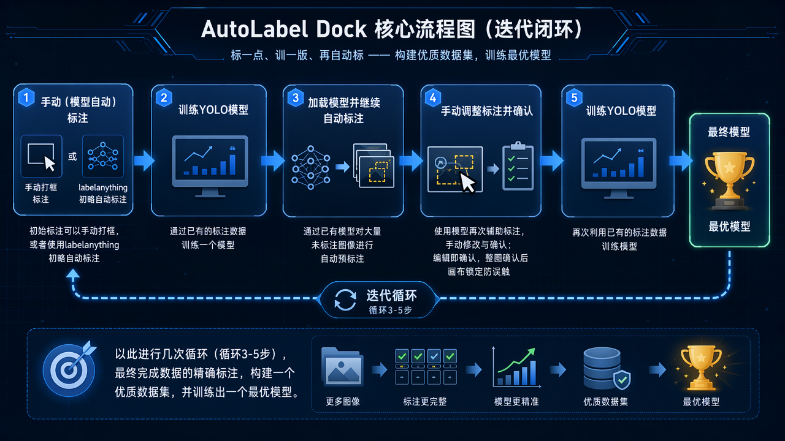
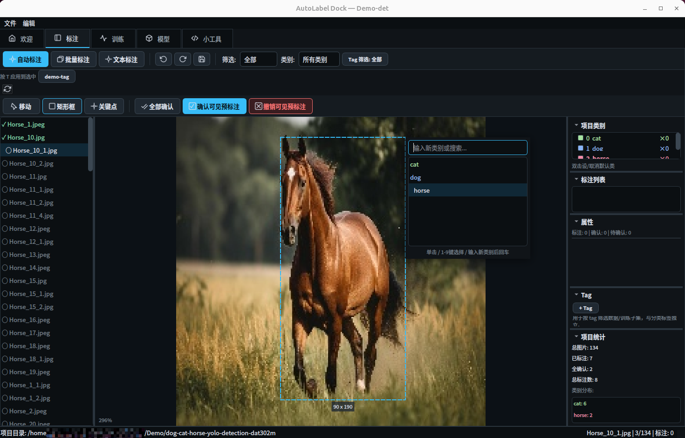
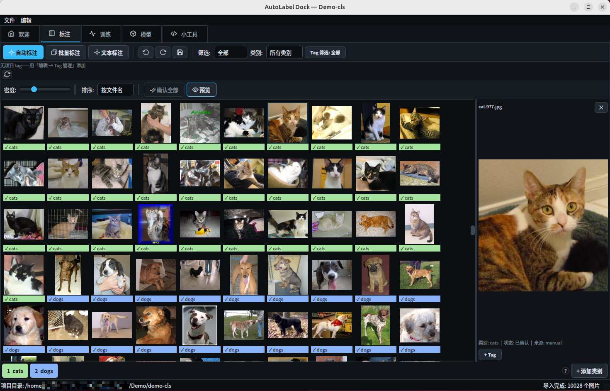
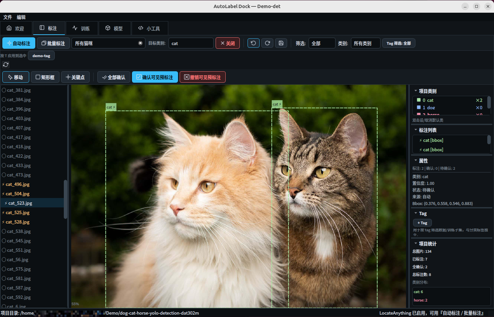
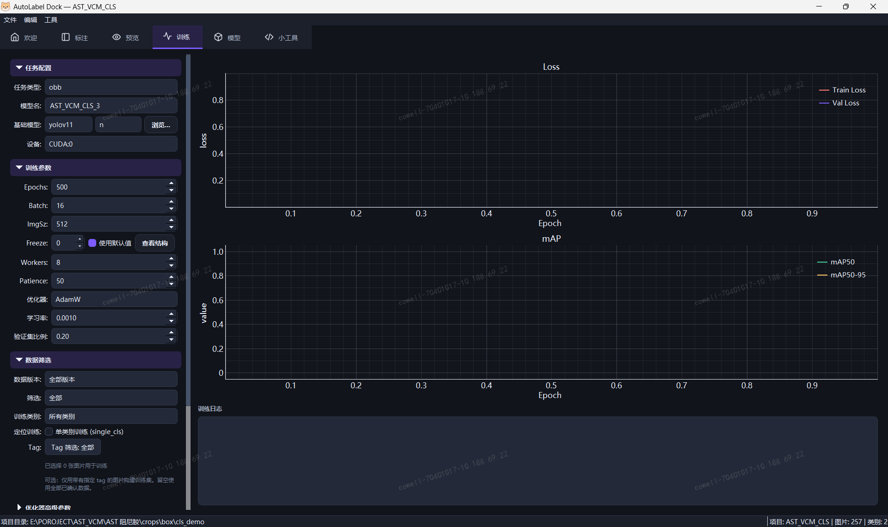
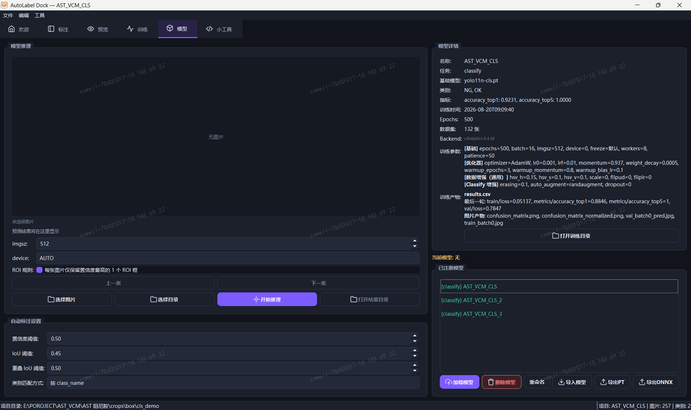

# AutoLabel Dock

> 标一点、训一版、再自动标：面向 YOLO 训练闭环的桌面端图像标注工具。


**简体中文** | [English](README_EN.md)

AutoLabel Dock 是一个基于 **PyQt5 + Ultralytics YOLO** 的桌面端图像标注与训练工具，支持 Linux、macOS 和 Windows。

它把“标注”和“训练”放在同一个工作流里：先人工标注一小批图片，或用已有模型预标注；人工确认后直接准备 YOLO 数据集并启动训练；训练完成的模型会自动注册到模型库并加载，用于继续自动标注剩余数据。



---

## 界面预览

| 面板 | 截图 |
|:---|:---:|
| 标注：检测 / 分割 / 姿态 |  |
| 分类 |  |
| LocateAnything |  |
| 训练 |  |
| 模型管理 |  |

---

## 主要功能

### 标注任务

- **目标检测 detect**：矩形框标注。
- **实例分割 segment**：多边形标注，也可在训练导出时从矩形框退化生成矩形多边形。
- **关键点姿态 pose**：矩形框 + 关键点骨架标注，支持关键点模板。
- **图像分类 classify**：整图单标签标注，支持缩略图网格和数字键快速打标。

### 标注体验

- 类 LabelImg 的键盘流操作。
- 画布支持绘制、选择、拖拽移动、缩放、平移、框尺寸调整、关键点放置、多边形点编辑。
- 单图独立撤销 / 重做栈，默认深度 50。
- 切图自动保存，图片使用 LRU 缓存。
- 图片列表按状态区分：未标注、待确认、已确认。
- 支持拖拽导入图片、右键批量确认、批量删除、批量移动到数据文件夹。
- 支持按状态、类别和自定义标签组合过滤。
- Catppuccin Mocha 深色主题。

### 数据文件夹

项目图片目录下可以维护多个数据文件夹，用来组织不同批次、版本或子集。

- 在标注界面创建、重命名、删除空数据文件夹。
- 向指定数据文件夹添加图片或图片目录。
- 在数据文件夹之间移动图片时，会同步移动镜像的标签 JSON。
- 训练和批量自动标注按当前可见图片或当前项目范围工作。
- `model_predictions/` 是模型面板目录推理结果目录，会从标注页图片扫描和数据文件夹树中排除。

### 模型辅助标注

- 加载 YOLO 权重后，可对单张图片或批量图片进行预标注。
- 批量推理在后台线程运行，逐图落盘，可取消。
- 新预测会和已有同类已确认标注按 IoU 匹配，避免重复框。
- 自动标注结果默认处于“待确认”状态；人工编辑或确认后转为已确认。
- 分类任务支持模型批量预测类别，并保护已有人工确认结果。
- 可选接入 LocateAnything-3B，用自然语言描述目标并生成检测框。

### 标签系统

这里的“标签”指图片级自定义标签，独立于分类任务的类别标签。

- 给图片添加任意自定义标签，用于筛选和组织数据集。
- 标签筛选支持三态：不限、包含、排除。
- 多个包含标签可按 AND / OR 组合。
- 选中多张图片后可批量打标签。
- 训练数据准备时可以复用同一套标签过滤器，只训练选中的子集。

### 训练闭环

- 一键准备 YOLO 训练数据集。
- 支持 detect、segment、pose、classify 四类 YOLO 任务。
- 按主类别进行 train / val 分层抽样。
- 数据集图片优先使用符号链接，失败后自动降级为硬链接或复制。
- 支持训练模板和完整超参数配置。
- 支持数据增强参数预览和配置。
- 训练过程实时显示 loss / mAP 等曲线。
- 支持中途取消训练。
- 训练完成后自动注册模型、保存训练参数和指标，并自动加载到推理面板。

### 模型管理

- 训练产物会自动加入模型库。
- 支持导入外部 `.pt` 权重。
- 支持模型重命名、删除和指标对比。
- 模型面板支持选择单张图片或目录进行原生推理，目录推理结果保存到项目 `model_predictions/`。
- 加载 YOLO 模型和启用 LocateAnything 时会避免同时占用 GPU。

### 导入 / 导出

| 格式 | 导出 | 导入 | 适用任务 |
|:---|:---:|:---:|:---|
| YOLO txt | 支持 | 支持 | 检测 / 分割 / 姿态 |
| COCO json | 支持 | 支持 | 检测 / 分割 / 姿态 |
| labelme json | 支持 | 支持 | 检测 / 分割 / 姿态 |
| iSAT json | 不支持 | 支持 | 检测 / 分割 |
| ImageFolder | 支持 | 支持 | 分类 |
| CSV | 支持 | 不支持 | 分类 |

### 数据安全

- 标注以单图 JSON 存储在项目 `labels/` 下，单个文件损坏不会影响其他图片。
- 导出、类别变更、恢复备份等高风险操作前会创建项目备份。
- 备份保存在项目 `.backups/`，默认保留最近 20 份。
- 恢复备份前会先对当前状态再做一次安全备份。
- 全局配置、最近项目、训练模板等保存在仓库根目录 `config/` 下。
- 日志输出到 `logs/`，便于排查推理、训练和 UI 问题。

---

## 快速开始

```text
1. 新建项目 -> 2. 导入图片 -> 3. 标注 / 预标注 -> 4. 确认 -> 5. 训练 -> 6. 继续迭代
```

1. 新建项目：选择任务类型 `detect`、`segment`、`pose` 或 `classify`，填写项目目录和初始类别。
2. 导入图片：将图片拖入文件列表，或通过数据文件夹菜单添加图片 / 图片目录。
3. 标注：手动画框、画多边形、放置关键点或选择分类标签；也可以加载 YOLO 权重进行自动预标注。
4. 确认：检查自动标注结果，修正后确认。
5. 训练：在训练面板选择基础模型、模板和超参数，准备数据集并启动训练。
6. 迭代：使用新训练模型继续标注未完成图片。

---

## 精细轮廓实例分割参数

下面的配置适合固定相机、单个环状目标、需要提取内外轮廓并进行面积、周长、胶宽等计算的 `segment` 项目。建议使用两阶段微调；第二阶段应选择第一阶段输出的 `best.pt` 作为基础模型。

当前示例数据只有一个 `item` 类别时，可启用 `single_cls`。训练前应保证：

- 只使用已经人工检查并确认的多边形标注。
- 训练集与验证集不包含同一实物或相邻重复帧。
- 不让 `train` 和 `val` 指向同一个图片目录。
- 修正自相交轮廓，并检查胶环内孔是否正确保留。
- 精细测量数据尽量使用高分辨率原图；提高 `imgsz` 不能恢复原图中不存在的细节。

### 第一阶段：冻结骨干网络

在训练面板中填写以下参数：

```yaml
task: segment
model: yolo26m-seg.pt
epochs: 40
batch: 4
imgsz: 1024
device: "0"
freeze: 10
workers: 4
patience: 15
val_ratio: 0.25

optimizer: AdamW
lr0: 0.001
lrf: 0.01
momentum: 0.937
weight_decay: 0.0005
warmup_epochs: 3.0
warmup_momentum: 0.8
warmup_bias_lr: 0.1

hsv_h: 0.0
hsv_s: 0.1
hsv_v: 0.2
degrees: 2.0
translate: 0.03
scale: 0.10
shear: 0.0
perspective: 0.0
flipud: 0.5
fliplr: 0.5
mosaic: 0.0
mixup: 0.0

mask_ratio: 2
overlap_mask: true
copy_paste: 0.0
copy_paste_mode: flip

single_cls: true
resume: false
```

### 第二阶段：全模型低学习率微调

选择第一阶段生成的 `best.pt`，取消 Freeze 的固定值并勾选“使用默认值”，其余参数按下面设置：

```yaml
task: segment
model: path/to/stage1/weights/best.pt
epochs: 120
batch: 4
imgsz: 1024
device: "0"
freeze: null
workers: 4
patience: 25
val_ratio: 0.25

optimizer: AdamW
lr0: 0.0003
lrf: 0.01
momentum: 0.937
weight_decay: 0.0005
warmup_epochs: 2.0
warmup_momentum: 0.8
warmup_bias_lr: 0.1

hsv_h: 0.0
hsv_s: 0.1
hsv_v: 0.2
degrees: 2.0
translate: 0.03
scale: 0.10
shear: 0.0
perspective: 0.0
flipud: 0.5
fliplr: 0.5
mosaic: 0.0
mixup: 0.0

mask_ratio: 2
overlap_mask: true
copy_paste: 0.0
copy_paste_mode: flip

single_cls: true
resume: false
```

参数说明：

| 参数 | 建议与原因 |
|:---|:---|
| `model` | 首选 `yolo26m-seg.pt`；显存不足时改用 `yolo26s-seg.pt`，不建议在极小数据集上直接使用 x 模型。 |
| `batch` | 以不发生显存溢出为准；`1024` 输入下依次尝试 4、2、1，不要通过降低 `imgsz` 优先解决。 |
| `mask_ratio` | `2` 比默认值 `4` 保留更细的训练掩膜；显存充足时可单独对比 `1`，不要与其他参数同时改变。 |
| `mosaic` | 关闭。该任务中目标占据大部分画面，Mosaic 会缩小目标并引入不真实的拼接边缘。 |
| `mixup` | 关闭。图像混合会制造不存在的半透明边界。 |
| `copy_paste` | 关闭。固定位置的单个胶环不适合粘贴出额外实例。 |
| `degrees` / `translate` / `scale` | 只使用轻量几何增强，避免插值和裁切破坏细边缘。 |
| `flipud` / `fliplr` | 仅当工件方向、光照方向和缺陷位置没有方向含义时使用 `0.5`；否则均设为 `0.0`。 |
| `overlap_mask` | 单实例图片保持 `true` 即可；它不会解决多边形自相交问题。 |
| `single_cls` | 项目始终只有一个目标类别时启用；未来增加类别时必须关闭。 |

分类任务专用的 `erasing`、`auto_augment`、`dropout`，以及姿态任务专用的 `pose`、`kobj`、`kpt_shape`，在 `segment` 训练中不会传给 Ultralytics，保持默认值即可。

### 推理与轮廓计算

- 训练和推理使用相同的 `imgsz=1024`。
- 推理保持 `retina_masks=True`，优先使用 `result.masks.data` 中的二值掩膜。
- 精密计算轮廓时使用 `cv2.RETR_CCOMP` 保留内孔，使用 `cv2.CHAIN_APPROX_NONE` 保留全部边缘点。
- 不要直接用经过较强 `approxPolyDP` 简化的多边形计算周长或胶宽。
- 除常规 mask mAP 外，建议统计 Boundary IoU、HD95、面积误差、周长误差和胶宽误差。
- 物理尺寸计算还需要相机标定，将像素坐标转换为实际长度单位。

相关参数可参考 [Ultralytics 训练配置](https://docs.ultralytics.com/modes/train)、[实例分割说明](https://docs.ultralytics.com/tasks/segment) 和 [数据增强说明](https://docs.ultralytics.com/guides/yolo-data-augmentation)。

---

## 快捷键

### 检测 / 分割 / 姿态

| 快捷键 | 功能 |
|:---|:---|
| `W` | 画框模式 |
| `P` | 多边形模式 |
| `K` | 关键点模式 |
| `V` | 选择 / 移动模式 |
| `Enter` | 完成当前多边形 |
| `Esc` | 取消当前多边形 |
| `A` / `←` | 上一张 |
| `D` / `→` | 下一张 |
| `Space` | 确认选中标注 |
| `Ctrl+Space` | 确认当前图片全部标注 |
| `Delete` | 删除选中标注 |
| `Ctrl+Z` / `Ctrl+Y` | 撤销 / 重做 |
| `Ctrl+C` / `Ctrl+V` | 复制 / 粘贴标注 |
| `Ctrl++` / `Ctrl+-` | 放大 / 缩小 |
| `Ctrl+0` | 适应窗口 |

### 分类

| 快捷键 | 功能 |
|:---|:---|
| `1` 至 `9` | 快速选择类别 |
| `Space` | 确认当前图片或选中图片 |
| `Delete` | 清除选中图片分类标签 |
| `Ctrl+Z` / `Ctrl+Y` | 撤销 / 重做 |

---

## 环境要求

- Python >= 3.10
- 操作系统：Linux / macOS / Windows
- 核心依赖：PyQt5、Ultralytics、pyqtgraph、PyYAML、packaging

训练和推理可使用 CPU，但实际训练建议使用 NVIDIA GPU。LocateAnything-3B 后端必须使用 NVIDIA GPU。

---

## 安装

推荐使用 Conda 创建独立环境：

```bash
git clone https://github.com/xzcGit/autolabel-dock.git
cd autolabel-dock
conda create -n autolabel python=3.10 -y
conda activate autolabel
pip install -r requirements.txt
```

如果需要启用可选的 LocateAnything-3B 文本标注后端，再安装额外依赖：

```bash
pip install -e ".[locateanything]"
```

---

## 运行

```bash
python main.py
```

Windows 下如遇到中文输出乱码，优先使用 Windows Terminal / PowerShell 7，并确保终端使用 UTF-8；程序启动时也会主动配置 Python UTF-8 环境。

---

## 模型权重

仓库中可能放有开发测试用的 YOLO 权重文件，但项目逻辑不依赖固定权重。你可以：

- 使用 Ultralytics 官方预训练模型，例如 `yolov8n.pt`、`yolo11n.pt`、`yolo11n-seg.pt` 等。
- 在模型面板导入外部 `.pt` 文件。
- 训练完成后直接使用自动注册的新模型。

如果 Ultralytics 自动下载失败，可以手动下载对应 `.pt` 文件并放到仓库根目录或通过模型面板导入。

---

## 可选：LocateAnything 文本标注

LocateAnything-3B 是可选的开放词汇检测后端，可用自然语言描述要标注的目标。未启用它时，其他功能不受影响。

启用条件：

1. 安装可选依赖：

   ```bash
   pip install -e ".[locateanything]"
   ```

2. 提前下载模型权重。运行时以后端离线方式加载，不会自动下载：

   ```bash
   hf download nvidia/LocateAnything-3B
   # 或旧工具：
   huggingface-cli download nvidia/LocateAnything-3B
   ```

3. 准备 NVIDIA GPU，并确保 `nvidia-smi` 可用。当前实现不支持 CPU 运行 LocateAnything；建议总显存不少于 6GB，启用时空闲显存不少于 5GB。

LocateAnything 运行在独立子进程中。启用 LocateAnything 会释放已加载的 YOLO 模型；反向加载 YOLO 或启动训练时，也会提示先关闭 LocateAnything，避免显存冲突。

---

## 平台说明

训练数据集准备会把原始图片组织到 YOLO 目录结构中。为减少磁盘占用，程序会按以下顺序创建图片引用：

```text
symlink 符号链接 -> hardlink 硬链接 -> copy 复制
```

| 方式 | 触发条件 | 速度 | 额外空间 |
|:---|:---|:---:|:---:|
| symlink | 系统支持且有权限；Linux / macOS 通常默认可用，Windows 需要开发者模式或管理员权限 | 快 | 几乎为零 |
| hardlink | symlink 失败，且源文件和目标目录在同一磁盘卷 | 快 | 几乎为零 |
| copy | 前两者都失败，例如 Windows 跨盘且未启用开发者模式 | 慢 | 与图片总大小相同 |

Windows 建议开启“开发者模式”，或尽量把项目目录和图片目录放在同一磁盘。项目路径建议使用英文或简单字符，减少第三方训练库在路径编码上的问题。

---

## 项目结构

```text
autolabel-dock/
├── config/                  全局配置、静态资源索引、训练模板
├── resources/screenshots/   README 截图资源
├── src/
│   ├── app.py               主窗口和整体编排
│   ├── controllers/         项目、模型、训练、标签、LocateAnything 控制器
│   ├── core/                数据模型、项目配置、标签 IO、导入导出、备份
│   ├── engine/              YOLO 训练 / 推理、数据集准备、模型后端
│   ├── ui/                  PyQt5 组件、画布、面板、对话框、视图
│   └── utils/               图片缓存、后台线程、文件链接、日志、撤销栈
├── main.py                  应用入口
├── pyproject.toml           项目元数据和可选依赖
├── requirements.txt         基础依赖
└── LICENSE                  AGPL-3.0 许可证
```

---

## 打包提示

仓库包含 `PyInstaller.txt`，可作为 PyInstaller 打包参考。打包时需要注意：

- PyQt5 插件和图标资源需要被正确收集。
- Ultralytics、torch 等训练依赖体积较大，建议按实际发布目标裁剪。
- LocateAnything 可选依赖不建议默认打入基础包。

---

## 开发

安装依赖后可直接运行：

```bash
python main.py
```

如添加测试，可使用：

```bash
pytest
```

---

## 许可证

本项目以 **[AGPL-3.0](LICENSE)** 发布。

核心依赖中 PyQt5 使用 GPL-3.0，Ultralytics 使用 AGPL-3.0。若需要在闭源或商业产品中集成，请自行确认并获取相关依赖的商业授权。

---

## Links

- [Linux DO](https://linux.do/)
